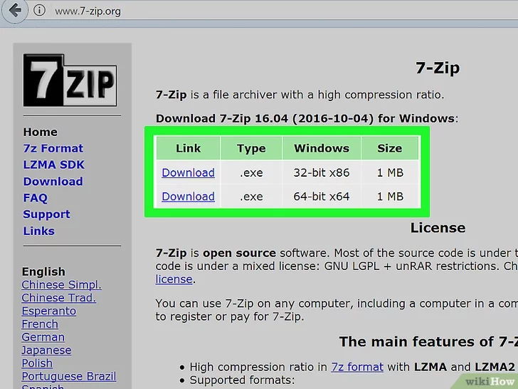
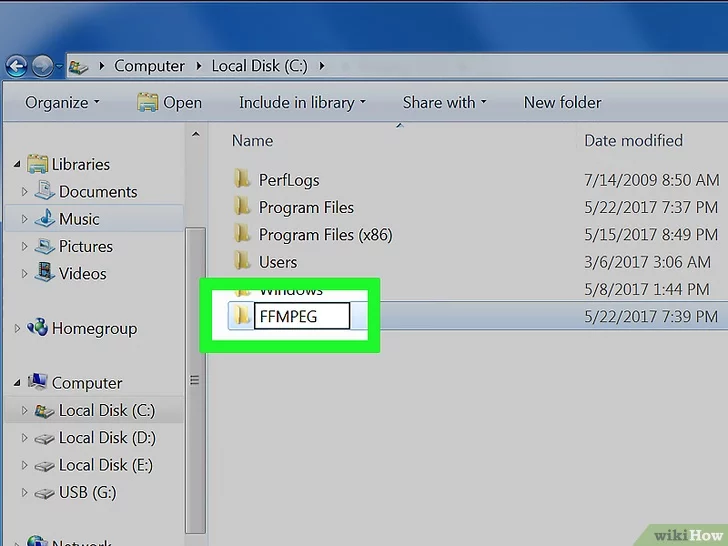
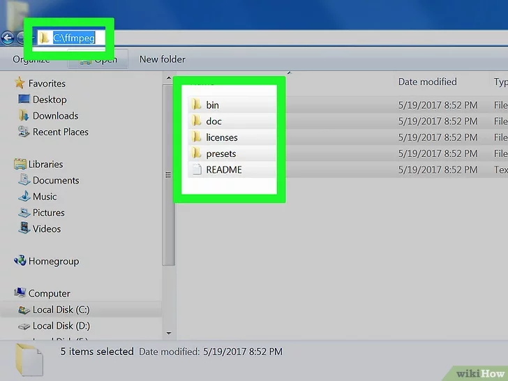
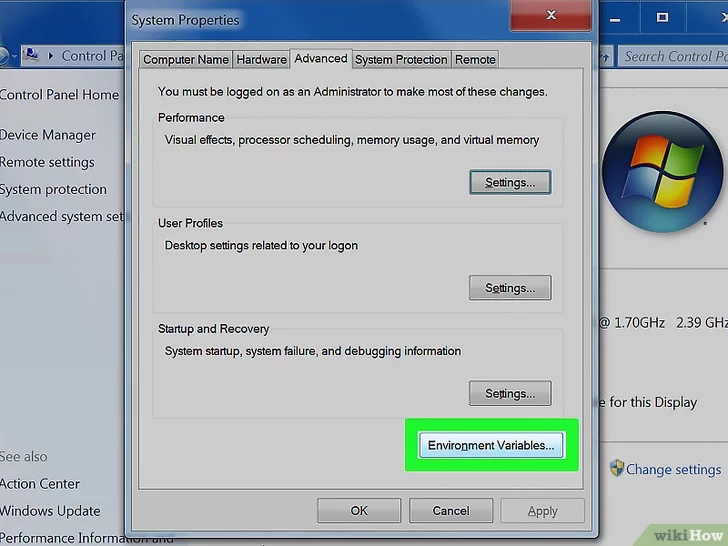
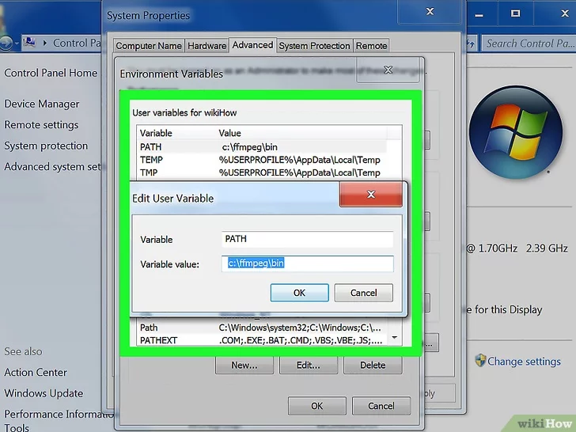
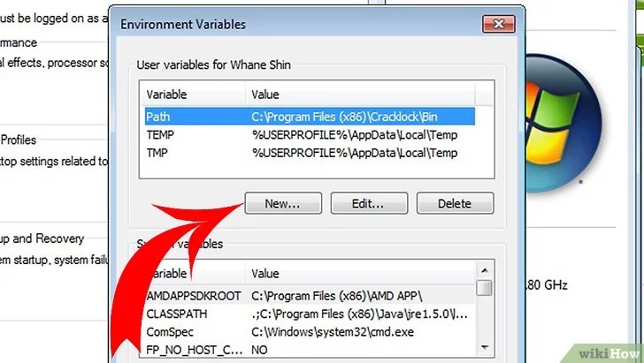
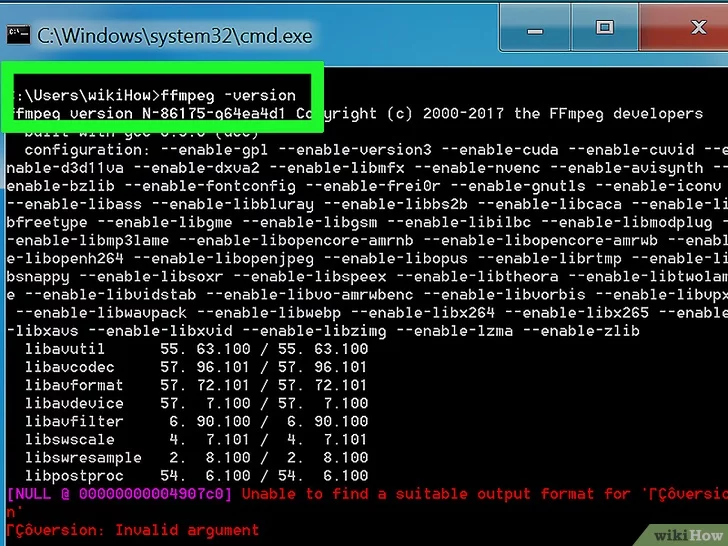
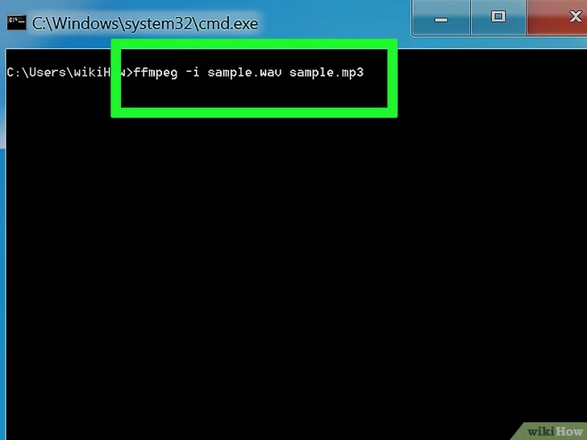

## 安装 ffmpeg


### Mac 系统

```shell
brew install ffmpeg
```

### Windows 系统

FFmpeg程序进行各种媒体格式的转换，使得它们可以在不同设备上播放。该程序只有命令行模式，因此将它安装到计算机中看上去有点麻烦，但是只要根据本指南的方法，你只需要几分钟就可以将FFmpeg安装成功！

1. 下载 ffmpeg


访问下载页面时，你将看到很多不同下载选项。你可以根据自己的操作系统选择下载最新的32位或64位静态程序版本。



2. 下载并安装7-zip

7-zip是一个免费的压缩管理程序，它可以让你打开FFmpeg文件。


3. 解压FFmpeg文件夹

当你使用7-zip来解压文件时，它会在原来下载文件位置生成一个新的文件夹。该文件夹名字类似于“ffmpeg-20130731-git-69fe25c-win32-static”。打开这个文件夹，以供稍后使用。



4. 打开C:盘

点击开始菜单，然后点击计算机。选择安装Windows系统的磁盘（一般是C:）。在C:盘的根目录下（该目录下有名为Windows和Program Files文件夹），右击并在弹出菜单中选择新建文件夹。将新文件夹命名为“ffmpeg”。



5. 打开新建的“ffmpeg”文件夹

将解压生成的文件夹中内容全部拷贝到“ffmpeg”文件夹中。


6. 点击开始菜单，然后右击计算机

在右键菜单中选择属性。在系统窗口中，点击左边窗体中的“高级系统设置”链接。



7. 点击系统属性窗口中的环境变量按钮



8. 在"用户变量"区域选择PATH条目

 - 它位于环境变量窗口中的第一个框架内。点击编辑按钮。
 - 在“变量值”栏，在其原始内容后输入;c:\ffmpeg\bin。如果你将ffmpeg拷贝到了其他磁盘，那么需要更改磁盘盘符。
 - 点击确认保存更改。如果在这个窗口输入的内容有误，那么有可能会造成Windows无法正常启动。
 - 如果在"用户变量"设置下没有PATH条目，点击新建按钮创建。在变量名栏输入PATH。



 - 这个方法可以让当前用户能够使用FFmpeg。其他Windows用户不能够使用。如果要使每个用户都能够使用，你需要在"系统变量"的PATH条目中添加;c:\ffmpeg\bin。注意不要够删除在变量中原来已有的内容。



9. 打开命令提示符窗口

输入命令“ffmpeg –version”。如果命令提示窗口返回FFmpeg的版本信息，那么就说明安装成功了，你可以在命令提示行中任意文件夹下运行FFmpeg。

如果你收到“libstdc++ -6 is missing”的错误消息，那么你可能需要安装Microsoft Visual C++ Redistributable Package，该软件包可以在微软网站免费获取。



10. 使用FFmpeg

你可以使用FFmpeg进行各种媒体格式的转换。你需要使用命令行才能够使用FFmpeg命令。


### 参考网站

- [ffmpeg 官网](http://ffmpeg.org/)
- [ffmpeg 下载地址](https://ffmpeg.zeranoe.com/builds/)
